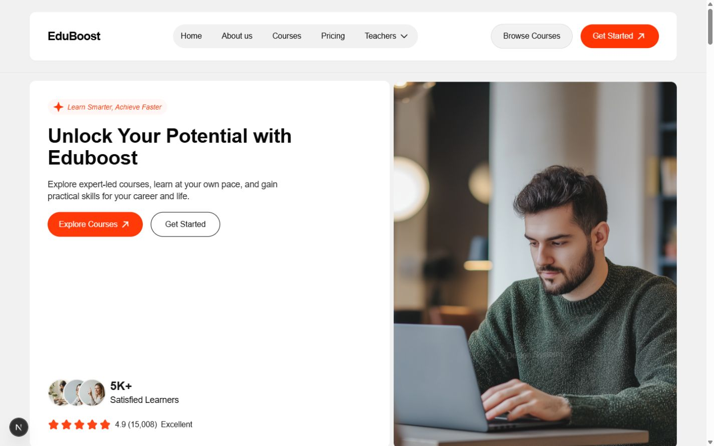
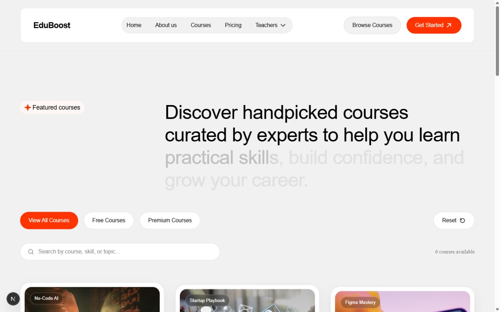

<div align="center">

# EduBoost

### A premium learning storefront for people building their next chapter.

Thoughtful course discovery, human-led learning, and a calm interface designed to make progress feel possible.

[Live site](https://eduboost-learning.netlify.app) · [View the code](https://github.com/rohanahmed24/eduboost-learning/tree/main) · [Run it locally](#run-locally) · [Explore the product tour](#product-tour)


</div>

<p align="center">
  
</p>

> EduBoost is a frontend portfolio build that turns an education brand into a complete, reviewable product experience—not just a collection of static screens.

## The product in one glance

| Discover | Compare | Commit |
| --- | --- | --- |
| Browse a focused course catalog with search and filters. | Move between pricing, course detail, lessons, and related learning paths. | Meet the educators, read learner stories, and follow clear next-step CTAs. |

### Why it feels like a real product

- **Clear intent:** every primary CTA leads somewhere useful, from the hero to course discovery and pricing.
- **Useful exploration:** search, free/premium filters, reset controls, course details, and lesson accordions work together as one journey.
- **Human trust signals:** teacher profiles, testimonials, FAQ content, and pricing are treated as product surfaces—not decoration.
- **Quiet polish:** consistent card geometry, generous spacing, responsive layouts, motion restraint, and reduced-motion support keep the experience composed.

## Product tour

<table>
  <tr>
    <td width="33%" valign="top">
      
      <br />
      <strong>Find the right course</strong><br />
      Search and filter a catalog that stays easy to scan.
    </td>
    <td width="33%" valign="top">
      
      <br />
      <strong>Learn from people</strong><br />
      Explore educators by discipline, with linked profile routes.
    </td>
    <td width="33%" valign="top">
      
      <br />
      <strong>Build confidence</strong><br />
      A warm, editorial landing page gives the product a point of view.
    </td>
  </tr>
</table>

## Core journeys

| Journey | Route | What to look for |
| --- | --- | --- |
| Start exploring | `/` | Hero CTA, featured courses, testimonials, FAQ, and newsletter success state |
| Browse the catalog | `/courses` | Search, free/premium filters, reset behavior, responsive cards, and course count |
| Open a course | `/courses/[slug]` | Teacher context, lesson accordion, related courses, and clear enrollment CTA |
| Meet the educators | `/teachers` | Responsive teacher grid and discipline-based navigation |
| View a profile | `/teachers/[slug]` | Profile detail route with relevant courses and a return path |
| Review the offer | `/#pricing` | Pricing tiers that connect back into the learning journey |

## What is functional

- Responsive navigation across home, about, courses, pricing, and teachers.
- Desktop Teachers menu with discipline shortcuts, linked profiles, outside-click dismissal, Escape handling, and active-state feedback.
- Course search with free/premium filters and a reliable reset action that restores the full catalog.
- Course detail pages with lesson accordions, instructor context, and related course navigation.
- Testimonial carousel with predictable previous/next controls, pagination, and touch swipe support.
- Accessible FAQ accordions and reduced-motion behavior for reveals and count-up animation.
- Newsletter form with validation and a local success state for frictionless portfolio review.

## Built with intention

| Area | Approach |
| --- | --- |
| Framework | Next.js App Router with TypeScript |
| UI | Tailwind CSS, reusable components, and Framer Motion |
| Content | Local typed data for courses, teachers, testimonials, and FAQs |
| Routing | Static course and teacher detail routes generated from local content |
| Accessibility | Semantic controls, visible focus states, labels, keyboard dismissal, and reduced motion |
| Responsive design | Mobile-first layouts with carefully tuned desktop spacing and image proportions |

## Repository map

```text
web/
├── app/
│   ├── _components/       # Shared navigation, cards, sections, and motion primitives
│   ├── _lib/              # Typed demo content and shared helpers
│   ├── courses/[slug]/    # Course detail experience
│   ├── teachers/[slug]/   # Teacher profile experience
│   └── page.tsx           # Editorial landing page
├── public/images/         # Course, teacher, and testimonial imagery
└── package.json           # Local scripts and dependencies
```

## Run locally

```bash
cd web
npm ci --workspaces=false
npm run dev
```

Open [http://localhost:3000](http://localhost:3000) and explore the main journeys above.

## Quality gate

```bash
npm run lint
npm run type-check
npm run build
```

## Scope, honestly stated

This is a polished frontend portfolio project. Course, learner, pricing, and testimonial content is demonstrative; production authentication, payments, enrollment persistence, and a newsletter backend are intentionally outside the current scope.

That keeps the experience fast to review while making the interaction design, component structure, responsive thinking, and implementation quality visible.

<div align="center">

Built with care by [Rohan Ahmed](https://github.com/rohanahmed24)

</div>
